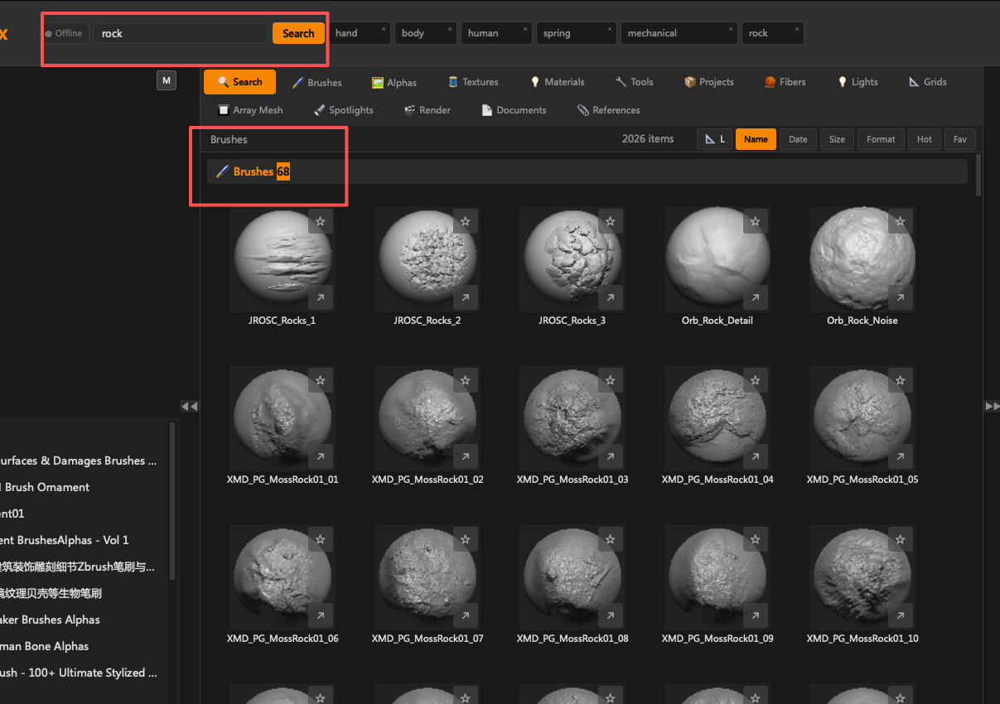
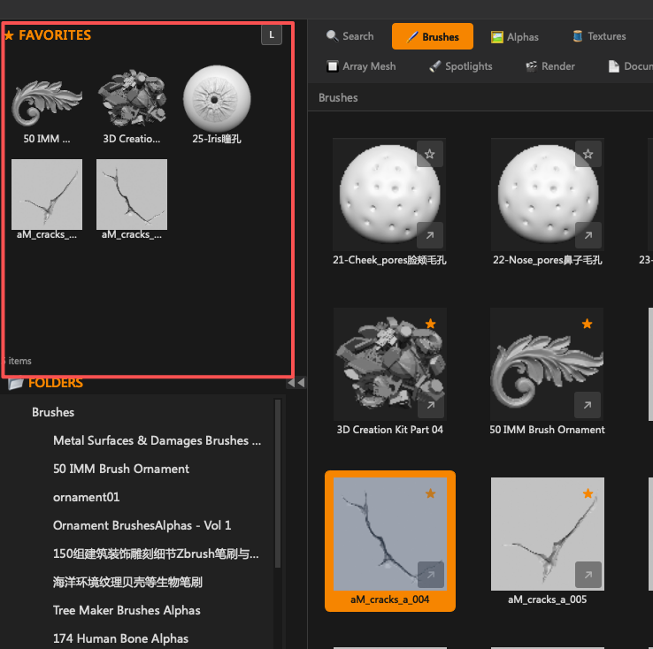
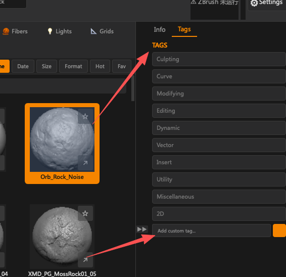
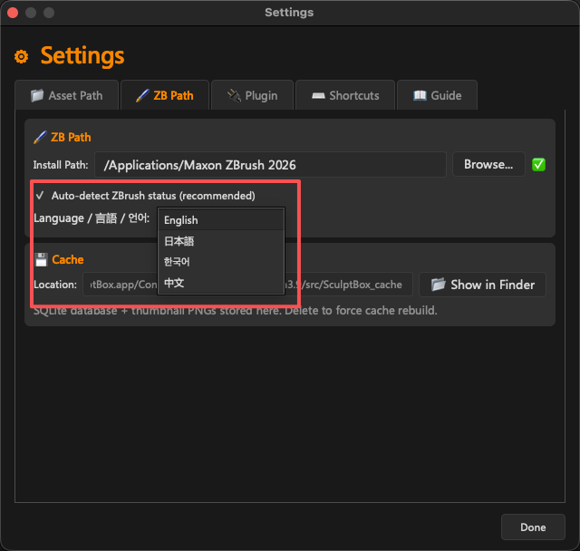
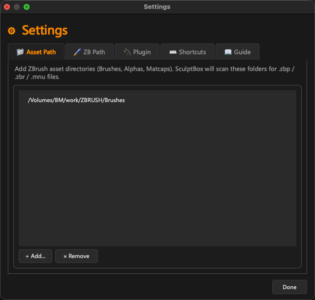
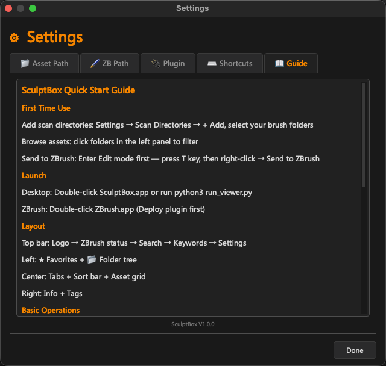

# SculptBox V1.0

**3D Asset Management Tool — Your brush library, at your fingertips.**

---

English · [中文](README.zh.md) · [日本語](README.ja.md) · [한국어](README.ko.md)

---

## Download

| Version | Download | Notes |
|:--------|:---------|:------|
| macOS V1.0 | [GitHub Releases](https://github.com/skillshen-boop/SculptBox/releases/latest) | Direct download |
| macOS V1.0 | [Baidu Pan](https://pan.baidu.com/s/1BeFZfMoCmqbfOQDEYJQdSg?pwd=tayr) | Code: tayr |

---

## First Time Install

macOS may show **"SculptBox is damaged and cannot be opened"**.

This is not a broken file — the app just hasn't been code-signed. Fix it with one command:

```bash
sudo xattr -rd com.apple.quarantine /Applications/SculptBox.app
```

Or go to **System Settings → Privacy & Security**, click **Open Anyway**.

---

## Quick Start

1. Download the DMG, drag SculptBox into Applications
2. If blocked, run the command above
3. Launch SculptBox
4. Go to **Settings → Plugin Status → Install** to deploy the ZBrush bridge
5. Restart ZBrush

---

## Features

### Brush Management


SculptBox indexes your entire brush library. Thousands of brushes, loaded in seconds.

- **Search** — Type any keyword, results appear instantly



- **Tags** — 10 auto-tags (Culpting, Curve, Insert, Utility...) + custom tags
- **Favorites** — Star your most-used brushes, access them in one click




- **Filter** — Browse by category or scan directory

### Thumbnail Preview

 

Every brush shows its real thumbnail — no more guessing from file names. Native .ZBP parsing, 50ms per brush. Supports S/M/L three sizes.

### Send to ZBrush


Right-click any brush → **Send to ZBrush**. The brush loads instantly via IPC bridge. No more manual file browsing in ZBrush.

### Batch Operations


Select multiple brushes → batch send to ZBrush, batch export thumbnails, batch tag.

### Multi-Language

4 languages built-in: English, Chinese, Japanese, Korean. Switch anytime in Settings.



### Plugin Status & One-Click Deploy


Settings → Plugin Status shows you everything:
- ZBrush installation status
- Bridge script deployment
- IPC directory readiness
- LaunchAgent status

Click **Install** to deploy the bridge in under a minute. No terminal, no config files.

### Settings & About

 

---

## How to Use

### Adding Your Brush Library

1. Open SculptBox
2. Click the Settings gear icon
3. Go to **Scan Directories** → **Add**
4. Select folders containing your .ZBP / .ZBR / .MNU files
5. Wait for scanning to complete

### Searching Brushes

Type in the search bar at the top. Results filter in real-time. Use tags on the right panel to narrow down by category.

### Sending to ZBrush

1. Make sure ZBrush is running
2. Right-click any brush
3. Click **Send to ZBrush**
4. The brush appears in ZBrush instantly

### Batch Sending

1. Select multiple brushes (hold Shift/Cmd)
2. Right-click → **Send to ZBrush**
3. SculptBox sends them one by one via IPC bridge

### Managing Tags

- Auto-tags are generated from file names
- Click tags on the right panel to filter
- Add custom tags via the tag editor
- Tags persist across sessions

---

## Requirements

- macOS 10.15+
- ZBrush 2026+ (for Send to ZBrush feature)
- Python 3.9+ (for development)

---

## Links

- Website: [sculptbox.net](https://sculptbox.net)
- Download: [GitHub Releases](https://github.com/skillshen-boop/SculptBox/releases)
- Feedback: [Issues](https://github.com/skillshen-boop/SculptBox/issues)

---

*SculptBox — 3D Asset Management Tool*
